 
## 查看主页获取源码

### 一、作品包含

源码+数据库+设计文档万字+PPT+全套环境和工具资源+部署教程

### 二、项目技术

前端技术：Html、Css、Js、Vue、Element-ui

数据库：MySQL

后端技术：Java、Spring Boot、MyBatis

  

### 三、运行环境

开发工具：IDEA/eclipse

数据库：MySQL5.7

数据库管理工具：Navicat10以上版本

环境配置软件： JDK1.8+Maven3.6.3

前端Nodejs：14

### 四、项目介绍
项目编号：springbootA172

高校洗浴管理系统是为了提高校园洗浴服务质量，优化资源配置，保障学生洗浴需求而开发的。系统以高校洗浴场景为背景，紧密结合高校学生洗浴的实际需求，旨在为学校提供一个便捷、高效、智能的洗浴管理平台，从而提升洗浴服务的整体水平，创造舒适、便捷的洗浴环境，满足学生们的日常洗浴需求，促进校园文化的建设。

前台学生功能：浏览首页、浴室信息、公告信息、后台管理、个人中心。

后台分为管理员和学生
管理员的功能：系统首页、个人中心、学生管理、浴室信息管理、浴室预约管理、预约签到管理、预约取消管理、充值信息管理、系统管理。
学生的功能：系统首页、个人中心、浴室预约管理、预约签到管理、预约取消管理、充值信息管理。

### 五、运行截图

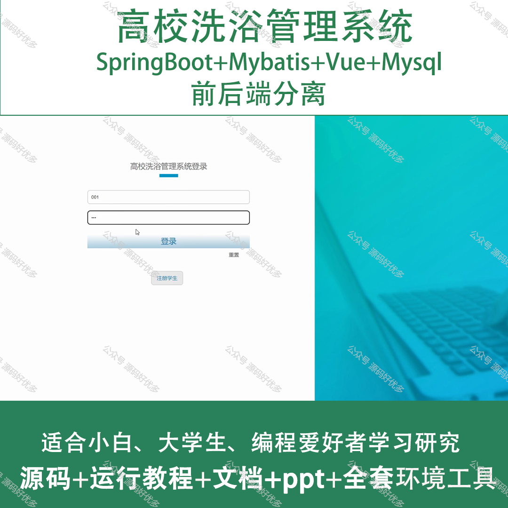
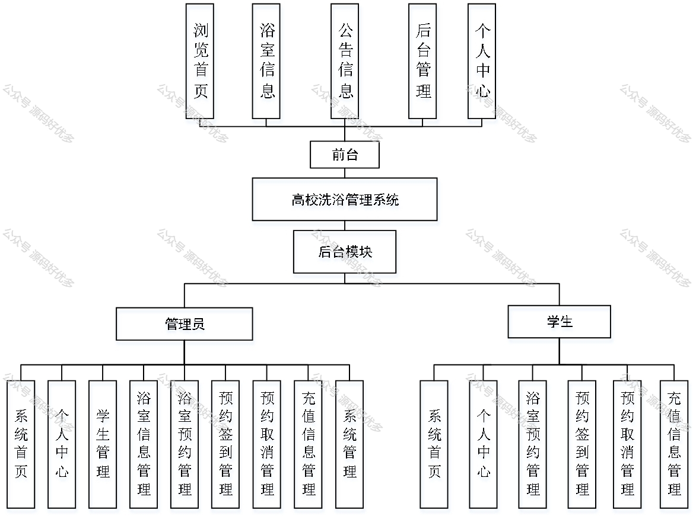
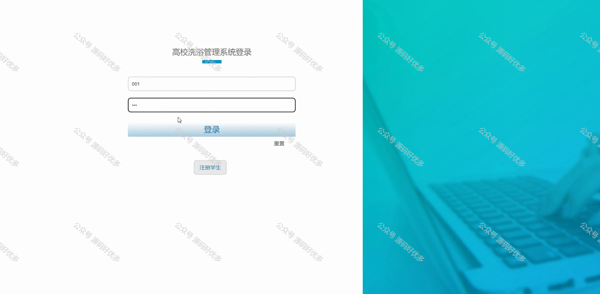
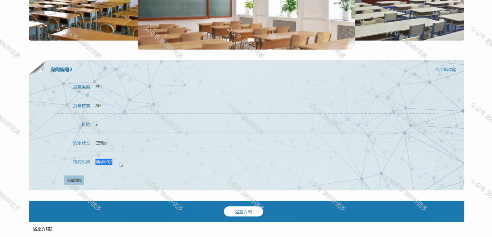
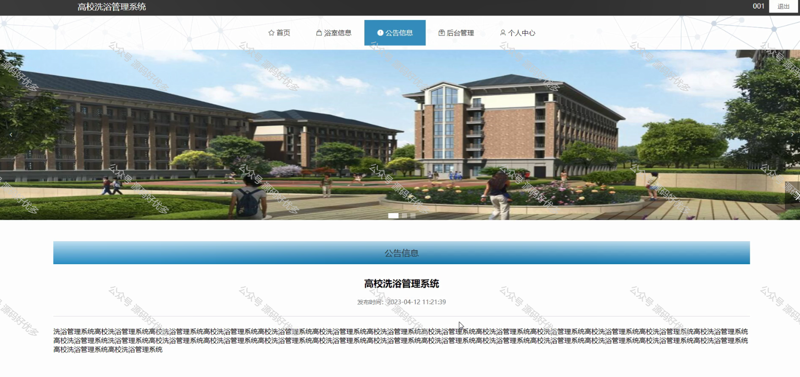
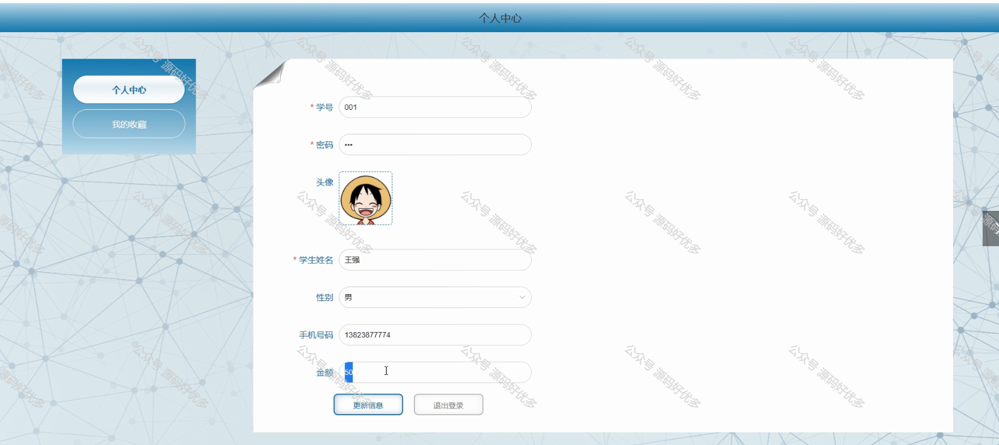
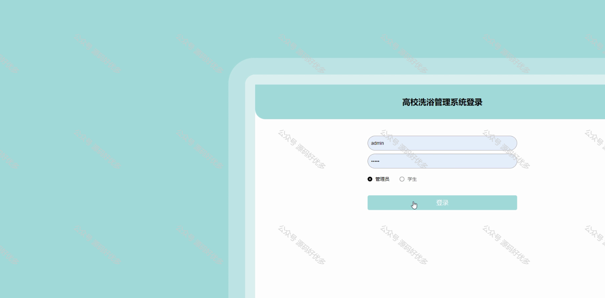
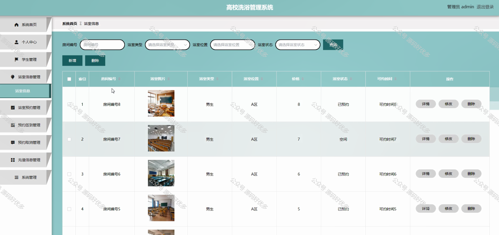
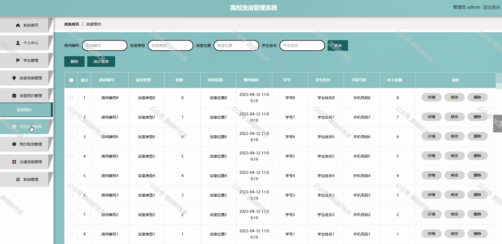
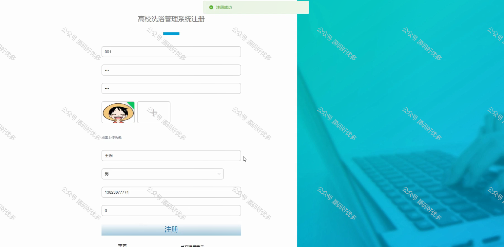
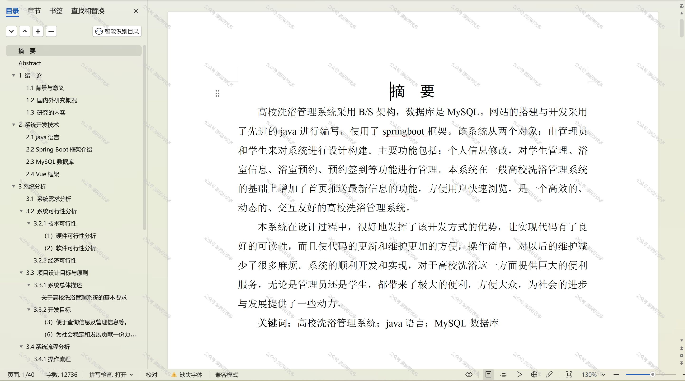

  
